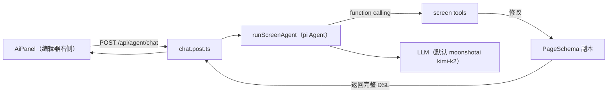

# Agent Server（pi 搭建）

大屏编辑器的 AI 助手后端。基于 [pi](https://github.com/badlogic/pi-mono)（`@mariozechner/pi-agent-core` + `@mariozechner/pi-ai`）实现 function-calling agent 循环，LLM 通过一组"大屏编辑工具"直接修改页面 DSL。

## 架构



- 编辑器把**当前页面 DSL + 用户消息 + 会话历史**发给 `/api/agent/chat`；
- 服务端在 DSL 副本上跑 pi `Agent`，LLM 通过工具增删改组件；
- 工具直接修改传入的 `page` 对象，循环结束后返回修改后的完整 DSL；
- 前端 `applyAiPage()` 整体应用，修改走撤销栈，可一键撤销。

## 目录

```text
server/
├── agent/
│   ├── materials.ts   # 服务端物料目录（复用 shared/materials 的纯数据定义）
│   ├── tools.ts       # 11 个大屏编辑工具（TypeBox schema）
│   └── loop.ts        # pi Agent 装配 + 系统提示词
└── api/
    └── agent/chat.post.ts   # POST /api/agent/chat
```

## 工具集

| 工具 | 作用 |
| --- | --- |
| `add_node` | 从物料目录添加组件（grid / precision 两种布点方式） |
| `update_node_props` | 合并组件 props（图表改 `option`，文本改 `content`） |
| `set_node_style` | 合并组件内联样式 |
| `set_node_layout` | 改位置尺寸（3 列 5 行网格或像素精确） |
| `arrange_grid` | 指定组件按 N 列自动排列 |
| `remove_node` / `duplicate_node` | 删除 / 复制组件 |
| `set_canvas` | 画布尺寸与背景色 |
| `add_data_source` | 添加静态 / API 数据源，可同时绑定组件 |
| `bind_data_source` | 把数据源绑到组件 |
| `list_nodes` | 列出画布组件 |

物料目录与前端共享：`app/materials/charts/index.ts` 从 `shared/materials/charts/*` 导入纯数据定义，服务端同样导入。新增物料只要落在 `shared/materials/`，AI 即可使用。

## API

`POST /api/agent/chat`

```jsonc
// 请求
{
  "message": "加一个销售额柱状图，放左上角",
  "page": { /* 当前完整 PageSchema */ },
  "history": [ { "role": "user" | "assistant", "content": "..." } ]
}

// 响应
{
  "reply": "已添加柱状图……",
  "actions": ["add_node: 柱状图(xxx) type=bar-chart layout=…"],
  "page": { /* 修改后的完整 PageSchema */ }
}
```

## 配置

LLM 通过 `nuxt.config.ts` 的 `runtimeConfig.ai` 配置，环境变量覆盖：

| 环境变量 | 默认值 | 说明 |
| --- | --- | --- |
| `NUXT_AI_PROVIDER` | `moonshotai` | pi-ai 供应商 id |
| `NUXT_AI_MODEL` | `kimi-k2-0905-preview` | 模型 id |
| `NUXT_AI_BASE_URL` | （跟随 provider） | 自定义 OpenAI 兼容端点 |
| `NUXT_AI_API_KEY` | 无（必填） | API Key，未设置时接口返回 503 |

`.env.local` 示例：

```bash
NUXT_AI_API_KEY=sk-xxx
# 用任意 OpenAI 兼容服务：
# NUXT_AI_PROVIDER=openai
# NUXT_AI_MODEL=gpt-4o-mini
# NUXT_AI_BASE_URL=https://your-proxy/v1
```

## 运行验证

```bash
NUXT_AI_API_KEY=sk-xxx pnpm dev
# 打开 /editor，右侧 AI 面板输入需求；或直接：
curl -X POST http://localhost:3000/api/agent/chat \
  -H 'content-type: application/json' \
  -d '{"message":"画布加一个标题文本","page":{"canvas":{"width":1920,"height":1080,"backgroundColor":"#0d121b"},"nodes":[],"dataSources":[]}}'
```
