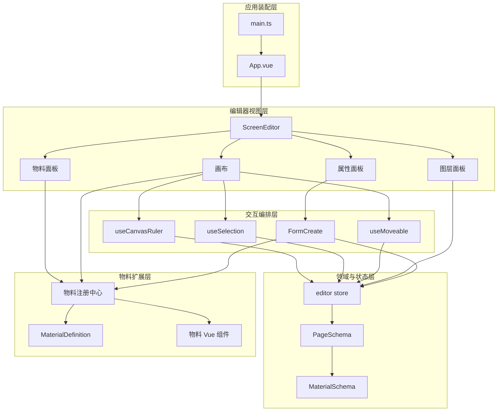
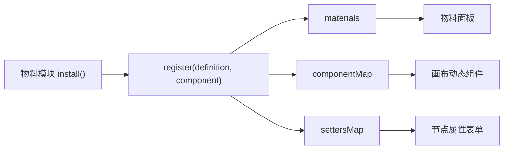
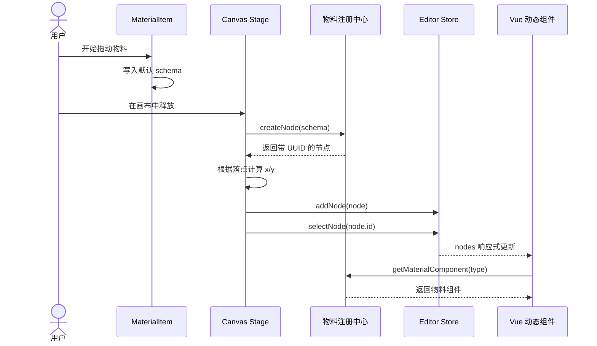
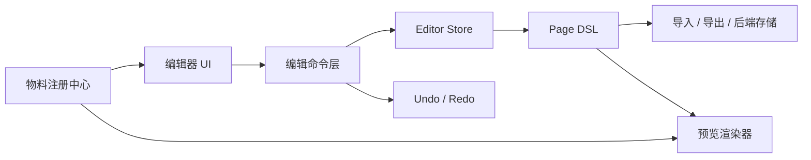

# ai-screen-design 项目架构设计

本文描述当前代码已经实现的架构，不把尚未落地的功能写成既成事实。核心代码只保留影响架构理解的部分，完整实现以 `src/` 为准。

## 1. 项目定位

`ai-screen-design` 是一个基于 Vue 3 的可视化大屏编辑器。用户从物料面板拖入组件，在画布中完成选择、移动、缩放和排序，再通过属性面板修改画布或节点数据。

当前实现覆盖编辑器的基础闭环：

- 物料自动发现与注册；
- 物料拖入画布并创建节点；
- 单选、框选、移动与缩放；
- 图层展示及拖动排序；
- 基于配置的动态属性表单；
- 页面 DSL 的内存态管理。

撤销重做、导入导出、持久化、预览发布和完整图表物料尚未实现。

## 2. 技术选型

| 技术                | 用途                               |
| ------------------- | ---------------------------------- |
| Vue 3 + TypeScript  | 组件系统、响应式数据和类型约束     |
| Pinia               | 编辑器状态与页面 DSL 管理          |
| Vite                | 开发构建、物料模块自动发现         |
| Element Plus        | 表单、折叠面板、下拉菜单等基础控件 |
| Tailwind CSS + Sass | 布局工具类、主题变量和颜色函数     |
| vue3-moveable       | 节点移动与缩放                     |
| vue3-selecto        | 框选及多选                         |
| vue3-sketch-ruler   | 画布标尺、缩放与辅助线容器         |
| vue-draggable-plus  | 图层列表排序                       |
| Iconify             | 编辑器图标                         |

## 3. 总体架构

系统按职责可分为五层：应用装配层、编辑器视图层、交互编排层、领域与状态层、物料扩展层。



架构的中心不是某个 UI 组件，而是 `PageSchema`。画布、图层和属性面板读取并修改同一份节点数据，避免各个面板分别维护副本。

## 4. 目录与模块职责

```text
src/
├── main.ts                          # 应用创建、插件安装、全局图标注册
├── App.vue                          # 编辑器入口
├── router/index.ts                  # 路由基础设施，当前无业务路由
├── schema/
│   ├── page.ts                      # 页面 DSL
│   └── material.ts                  # 物料定义及节点实例类型
├── stores/editor.ts                 # 页面数据、选择状态、节点命令
├── material/
│   ├── index.ts                     # 自动发现、注册与查询物料
│   ├── text/                        # 文本物料定义及渲染组件
│   └── charts/                      # 图表物料占位定义
├── editor/
│   ├── index.vue                    # 编辑器布局
│   ├── canvas/
│   │   ├── index.vue                # 画布编排、节点渲染、拖入、右键命令
│   │   └── composables/
│   │       ├── useCanvasRuler.ts    # 标尺尺寸、缩放、画布样式
│   │       ├── useSelection.ts      # 单选、框选、选中 DOM 同步
│   │       └── useMoveable.ts       # 移动、缩放及 DSL 回写
│   ├── panels/
│   │   ├── material/                # 物料分类与列表
│   │   ├── layer/                   # 图层列表和排序
│   │   └── components/MaterialItem.vue
│   ├── property/
│   │   ├── index.vue                # 画布属性/节点属性切换
│   │   └── components/              # 动态表单和具体属性面板
│   └── toobar/                      # 顶部工具栏；当前目录名拼写如此
├── styles/                          # 全局样式、变量和 Sass 函数
└── util/index.ts                    # 防抖及点路径读写
```

## 5. 领域模型

### 5.1 页面 DSL

页面 DSL 是可保存、可恢复的页面描述。它不包含当前选中项、面板显隐等编辑器临时状态。

```ts
// src/schema/page.ts
interface CanvasSchema {
  width: number
  height: number
  backgroundColor: string
}

export interface PageSchema {
  canvas: CanvasSchema
  nodes: MaterialSchema[]
}
```

### 5.2 节点实例

`MaterialSchema` 表示画布中的一个运行时节点。

```ts
// src/schema/material.ts
interface Layout {
  x: number
  y: number
  width: number
  height: number
}

export interface MaterialSchema {
  type: string
  name: string
  id: string
  locked?: boolean
  layout: Layout
  style: Record<string, any>
  props: Record<string, any>
}
```

字段职责：

- `id`：区分同类型的多个节点，也是 DOM 与状态关联的键；
- `type`：从物料注册中心查找渲染组件和属性配置；
- `layout`：画布坐标及尺寸；
- `style`：直接影响视觉表现的数据；
- `props`：组件业务属性；
- `locked`：控制节点是否允许进入 Moveable 操作目标。

### 5.3 物料定义

物料定义是创建节点之前的模板，同时携带编辑器需要的元数据。

```ts
export interface MaterialDefinition {
  name: string
  group: string
  icon: string
  setters: SetterSchema[]
  schema: Omit<MaterialSchema, 'id'>
}
```

物料定义与节点实例之间的关系：

```text
MaterialDefinition.schema + 运行时 UUID + 落点坐标 = MaterialSchema
```

## 6. 状态架构

`src/stores/editor.ts` 同时管理领域数据和编辑器 UI 状态。

```ts
export const useEditorStore = defineStore('editor', () => {
  const panelVisible = reactive({
    material: true,
    layer: true,
    property: true,
  })

  const page = ref<PageSchema>({
    canvas: {
      width: 1920,
      height: 1080,
      backgroundColor: '#0d121b',
    },
    nodes: [],
  })

  const nodes = toRef(page.value, 'nodes')
  const canvas = toRef(page.value, 'canvas')
  const selectedNodeIds = ref<string[]>([])
})
```

状态可按生命周期分成两类：

| 状态       | 内容                              | 是否应持久化 |
| ---------- | --------------------------------- | ------------ |
| 页面状态   | `canvas`、`nodes`                 | 是           |
| 编辑器状态 | `panelVisible`、`selectedNodeIds` | 否           |

单选节点由多选状态派生，而不是另存一份：

```ts
const selectedNodeId = computed(() => {
  return selectedNodeIds.value.length === 1 ? selectedNodeIds.value[0] : null
})

const selectedNode = computed(() => {
  return nodes.value.find((node) => node.id === selectedNodeId.value)
})
```

这保证了单选、框选和清空选择使用同一套基础状态。

## 7. 物料注册机制

物料系统采用注册表模式。注册中心维护三个索引：

```ts
// src/material/index.ts
const materials: MaterialDefinition[] = []
const componentMap = new Map()
const settersMap = new Map()

export function register(material: MaterialDefinition, component: Component) {
  materials.push(material)
  componentMap.set(material.schema.type, component)
  settersMap.set(material.schema.type, material.setters)
}
```

三个索引分别服务于物料列表、画布渲染和属性表单：



Vite 在启动阶段自动发现物料模块：

```ts
const materialModules = import.meta.glob('./*/index.ts', {
  eager: true,
})

Object.values(materialModules).forEach((materialModule) => {
  materialModule.install(register)
})
```

文本物料的注册入口如下：

```ts
// src/material/text/index.ts
export function install(register) {
  register(textMaterial, TextMaterial)
}
```

这种机制使新增物料主要发生在 `src/material/<type>/` 内，画布和属性面板不需要增加类型分支。

## 8. 核心流程一：创建并渲染节点



拖动源只传输默认 schema：

```ts
// MaterialItem.vue
function onStart(e: DragEvent) {
  e.dataTransfer.setData('scheme', JSON.stringify(props.material.schema))
}
```

画布完成实例化、定位和入库：

```ts
// editor/canvas/index.vue
function onDrop(e: DragEvent) {
  const data = e.dataTransfer.getData('scheme')
  const node = createNode(JSON.parse(data))

  node.layout.x = e.offsetX - node.layout.width / 2
  node.layout.y = e.offsetY - node.layout.height / 2

  editorStore.addNode(node)
  editorStore.selectNode(node.id)
}
```

`createNode()` 增加运行时身份：

```ts
export function createNode(node: MaterialSchema) {
  return {
    ...node,
    id: window.crypto.randomUUID(),
  }
}
```

节点渲染不依赖类型判断，而是查注册表：

```vue
<component :is="getMaterialComponent(node.type)" :schema="node" />
```

## 9. 核心流程二：选择、移动与缩放

### 9.1 选择状态与 DOM 的映射

Pinia 保存节点 id，Moveable 需要真实 DOM。`useSelection()` 负责两者之间的转换：

```ts
watch(
  selectedNodeIds,
  (ids) => {
    selectedTarget.value = ids.map((id) => {
      return stageRef.value.querySelector(`[data-node-id="${id}"]:not([data-node-locked='true'])`)
    })
  },
  { deep: true, flush: 'post' },
)
```

`flush: 'post'` 让查询发生在 Vue 完成 DOM 更新之后。节点刚被拖入并选中时，这一点尤其重要。

Selecto 框选结束后，将 DOM 再转换回 id：

```ts
function onSelectEnd(e) {
  const ids = e.selected.map((element) => {
    return element.getAttribute('data-node-id')
  })
  editorStore.selectNodes(ids)
}
```

### 9.2 交互期间的双写策略

Moveable 拖动时同时更新 DOM 和 DSL：

```ts
// useMoveable.ts
function onDrag(e: OnDrag) {
  e.target.style.left = e.left + 'px'
  e.target.style.top = e.top + 'px'

  const node = getNodeByTarget(e.target as HTMLElement)
  node.layout.x = e.left
  node.layout.y = e.top
}
```

直接修改 DOM 保证高频拖动时的即时反馈；更新 `node.layout` 保证属性面板、图层和后续持久化读取到最新数据。

缩放除了更新尺寸，还复用拖动逻辑同步位置：

```ts
function onResize(e: OnResize) {
  e.target.style.width = e.width + 'px'
  e.target.style.height = e.height + 'px'

  const node = getNodeByTarget(e.target as HTMLElement)
  node.layout.width = e.width
  node.layout.height = e.height

  onDrag(e.drag)
}
```

从左侧或上侧缩放会同时改变 `x/y`，因此不能只更新宽高。

## 10. 核心流程三：动态属性表单

属性面板根据是否存在单选节点切换内容：

```vue
<!-- editor/property/index.vue -->
<NodeProperty v-if="selectedNode" />
<CanvasProperty v-else />
```

节点属性由公共布局配置和物料专属 setters 组成。文本物料示例：

```ts
setters: [
  {
    type: 'input',
    label: '内容',
    key: 'props.content',
  },
  {
    type: 'color',
    label: '颜色',
    key: 'style.color',
  },
]
```

`FormCreate` 把 setter 类型映射为 Element Plus 组件：

```ts
const componentMap = {
  input: ElInput,
  number: (props) =>
    h(ElInputNumber, {
      precision: 0,
      ...props,
    }),
  color: ElColorPicker,
}
```

模板通过点路径读写节点：

```vue
<component
  :is="componentMap[item.type]"
  :modelValue="getValue(formData, item.key)"
  @update:modelValue="(value) => setValue(formData, item.key, value)"
/>
```

以 `props.content` 为例，更新链路是：

```text
ElInput
  → setValue(selectedNode, "props.content", value)
  → Pinia 中的节点发生变化
  → TextMaterial 重新渲染 schema.props.content
```

## 11. 图层模型

画布以节点数组下标生成层级：

```ts
function getNodeStyle(node: MaterialSchema, index: number) {
  return {
    width: node.layout.width + 'px',
    height: node.layout.height + 'px',
    left: node.layout.x + 'px',
    top: node.layout.y + 'px',
    zIndex: index + 1,
  }
}
```

因此 `nodes` 的顺序就是图层顺序。`LayerPanel` 直接把 `nodes` 交给 `vue-draggable-plus`：

```ts
useDraggable('.layer-panel', nodes, {
  animation: 150,
})
```

列表采用 `column-reverse` 展示，使视觉上的顶层节点出现在列表顶部。这个反转只影响展示，不改变数组仍以“前低后高”表达层级的事实。

## 12. 画布与标尺

`useCanvasRuler()` 管理三类状态：

- 页面 DSL 中的画布宽高和背景色；
- 标尺自身的缩放比例与辅助线；
- 编辑器可见区域的实时宽高。

画布样式从 Pinia 派生：

```ts
const canvasStyle = computed(() => ({
  width: canvasWidth.value + 'px',
  height: canvasHeight.value + 'px',
  backgroundColor: canvas.value.backgroundColor,
}))
```

外层区域通过 `ResizeObserver` 监听尺寸变化，并使用 300ms 防抖更新标尺容器。缩放变化后调用 `moveableRef.value.updateRect()`，重新计算操作框位置。

## 13. 样式架构

样式入口为 `src/styles/index.css`：

```css
@import 'tailwindcss';
@import './variable.scss';
@import './global.scss';

@theme {
  --spacing: 1px;
}
```

项目把 Tailwind 间距基准改为 `1px`，所以 `w-300`、`h-56`、`p-20` 分别表示 300px、56px、20px。

全局主题目前以少量 CSS 变量为基础：

```scss
:root {
  --border-color: #334155;
  --bg-color: #1b2436;
}
```

Sass 函数 `bg-mix()` 从主背景色派生面板深浅：

```scss
@function bg-mix($value) {
  @return color-mix(in srgb, var(--bg-color), black #{$value + '%'});
}
```

该函数由 Vite 的 `additionalData` 注入全部 Vue 样式块，组件可以直接调用。

## 14. 新增物料的标准步骤

以新增图片物料为例：

```text
src/material/image/
├── index.ts
└── component.vue
```

`index.ts` 定义元数据、默认 DSL、setter，并导出统一安装函数：

```ts
import ImageMaterial from './component.vue'
import type { MaterialDefinition } from '@/schema/material'

const imageMaterial: MaterialDefinition = {
  name: '图片',
  group: 'info',
  icon: 'material-symbols:image',
  setters: [
    {
      type: 'input',
      label: '地址',
      key: 'props.src',
    },
  ],
  schema: {
    type: 'image',
    name: '图片',
    locked: false,
    layout: {
      x: 0,
      y: 0,
      width: 320,
      height: 180,
    },
    style: {},
    props: {
      src: '',
    },
  },
}

export function install(register) {
  register(imageMaterial, ImageMaterial)
}
```

渲染组件只关心节点 schema：

```vue
<script setup lang="ts">
defineProps(['schema'])
</script>

<template>
  
</template>
```

由于物料模块由 `import.meta.glob` 自动发现，无需修改注册中心。新增物料完成的判断标准不是“左侧能看到”，而是以下链路全部成立：

```text
物料列表 → 拖入创建 → 画布渲染 → 属性编辑 → DSL 更新
```

## 15. 当前约束与已知风险

### 类型约束较弱

`style`、`props`、setter 扩展字段以及多个 composable 参数仍使用 `any` 或隐式类型。`Map` 也没有声明键值泛型。随着物料增加，错误会推迟到运行时暴露。

建议后续优先完善：

```ts
type SetterType = 'input' | 'number' | 'color'

interface SetterSchema {
  key: string
  label: string
  type: SetterType
  span?: number
}
```

### 节点命令存在实现错误

当前 `copyNode()` 把整个节点传给只接收 id 的 `selectNode()`；`moveTop()` 和 `moveBottom()` 又在字符串数组 `selectedNodeIds` 中读取 `item.id`。复制后的选中和图层移动需要修正后才能作为稳定能力使用。

### 属性配置不是响应式派生

`NodeProperty.vue` 在 setup 阶段读取一次 setters：

```ts
const setters = getMaterialSetters(selectedNode.value.type)
```

当组件没有重新挂载、仅切换到另一物料类型时，配置可能仍是旧值。应改为基于 `selectedNode.value?.type` 的 `computed`。

### 图表物料未闭环

图表定义当前调用 `register(barMaterial)`，没有传入渲染组件。画布查到的组件会是 `undefined`，该物料只能视为占位实现。

### 右键命令依赖全局选中节点

每个节点的下拉菜单共用 `onCommand()`，命令实际作用于 `editorStore.selectedNode`。需要保证打开右键菜单前目标节点已同步为当前选中项，否则可能操作错误节点。

### 持久化与历史记录缺失

`page` 已经具备序列化基础，但尚无存储适配层，也没有命令历史。后续实现撤销重做时，不宜直接在组件事件中堆叠快照逻辑，建议把可撤销操作统一为命令或事务。

## 16. 后续演进建议

建议按依赖顺序推进：

1. 修复节点复制、层级移动和动态 setters，补充 store 单元测试。
2. 收紧 Schema、Setter、注册表及 composable 参数类型。
3. 完成一个非文本物料，验证物料扩展协议是否足够。
4. 增加页面 DSL 的导入、导出和校验。
5. 把节点变更收敛为 store action，为撤销重做建立边界。
6. 拆分编辑态渲染与预览态渲染，避免发布页面依赖编辑器组件。
7. 物料数量增加后再考虑异步加载与构建拆包。

目标状态可以保持当前数据驱动方向，但补齐存储与命令边界：



## 17. 构建与验证

```bash
pnpm build
```

截至 2026-07-24，类型检查与 Vite 生产构建可以通过。构建产物中主 JavaScript 文件约 674 kB（gzip 约 229 kB），Vite 提示单 chunk 超过 500 kB；另有来自第三方依赖的 Rolldown pure annotation 警告，不影响本次构建完成。
